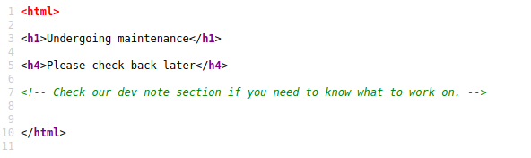

# Tryhackme - [Basic Pentesting](https://tryhackme.com/room/basicpentestingjt) 
Written on 19/12/2021


## Nmap 
I started an nmap scan to find open ports and hosted services on the machine
```
sudo nmap -vv -sT -sV -O --top-ports 1024 -oN nmap.txt 10.10.64.148
```


## Gobuster
Noticing that there is a webserver on port 80, I ran gobuster on it 

```
gobuster dir
```

The website itsself didn't seem too interesting, just a page stating that it's "Undergoing maintenance"

I checked the source code, found this comment:



That comment seems related to the results of the gobuster scan, which found the /development directory:


> What is the name of the hidden directory on the web server(enter name without /)?

Answer: development

Checking out /development, there are two files: **dev.txt** and **j.txt**

Contents:
```
j.txt:
For J:

I've been auditing the contents of /etc/shadow to make sure we don't have any weak credentials,
and I was able to crack your hash really easily. You know our password policy, so please follow
it? Change that password ASAP.

-K
```
^ This hints that J's password may be bruteforce-able


```
dev.txt:
2018-04-23: I've been messing with that struts stuff, and it's pretty cool! I think it might be neat
to host that on this server too. Haven't made any real web apps yet, but I have tried that example
you get to show off how it works (and it's the REST version of the example!). Oh, and right now I'm 
using version 2.5.12, because other versions were giving me trouble. -K

2018-04-22: SMB has been configured. -K

2018-04-21: I got Apache set up. Will put in our content later. -J

```
^ This tells us that K has set up Apache struts version 2.5.12, so we can do some googling on that to find [this CVE](https://www.cvedetails.com/cve/CVE-2017-9805/) 

I looked it up on ExploitDb, but the scripts I found on ExploitDb weren't working. Then I tried the metasploit exploit, but I couldn't get that to work either, so I moved on.


## Enum4linux
The hint on Tryhackme said to try and enumerate SMB, so I used enum4linux to do that:

```
enum4linux -a 10.10.64.148 > enum4linux.txt
```

From the results we find two usernames:


> What is the username?

Answer: jan

> What is the name of the other user you found(all lower case)?

Answer: kay


## Hydra

We know that ssh is running. To log into ssh as jan we can use hydra and the rockyou.txt wordlist to find jan's password:

```
hydra -t 4 -l jan -P /usr/share/wordlists/rockyou.txt ssh://10.10.64.148
```


> What is the password?

Answer: armando

> What service do you use to access the server(answer in abbreviation in all caps)?

Answer: SSH

Now we can ssh onto the machine as jan

```
ssh jan@10.10.64.148
```


## Looking around
Looking around kay's home folder, we find a pass.bak file that we can't read, and inside his .ssh folder, we see that his private key(id_rsa) is world readable


I copied that onto my local machine and changed it's permissions with

```
chmod 600 kay_id_rsa
```

When I tried to login, it prompted for a passphrase

We can try to crack the passphrase using John the ripper, however first we have to pass the id_rsa file through ssh2john

```
python2 /usr/share/john/ssh2john.py kay_id_rsa > sshforjohn
```

Then we can run john normally on that file

```
john -wordlist=/usr/share/wordlists/rockyou.txt sshforjohn
```


## Logging in as kay
Now that we can supply the passphrase we can log in as kay on the machine

```
ssh -i kay_id_rsa kay@10.10.64.148
```

And we can now read that pass.bak file to answer the THM question:


## Conclusion
This took me a lot longer than it could have because I tried to make those Apache Struts RCE exploits work, but I guess the room illustrates that sometimes you'll fall down rabbit holes, and shouldn't get stuck, but instead try other attack vectors.
