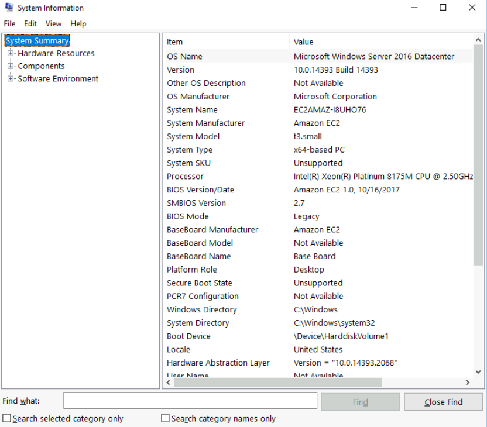
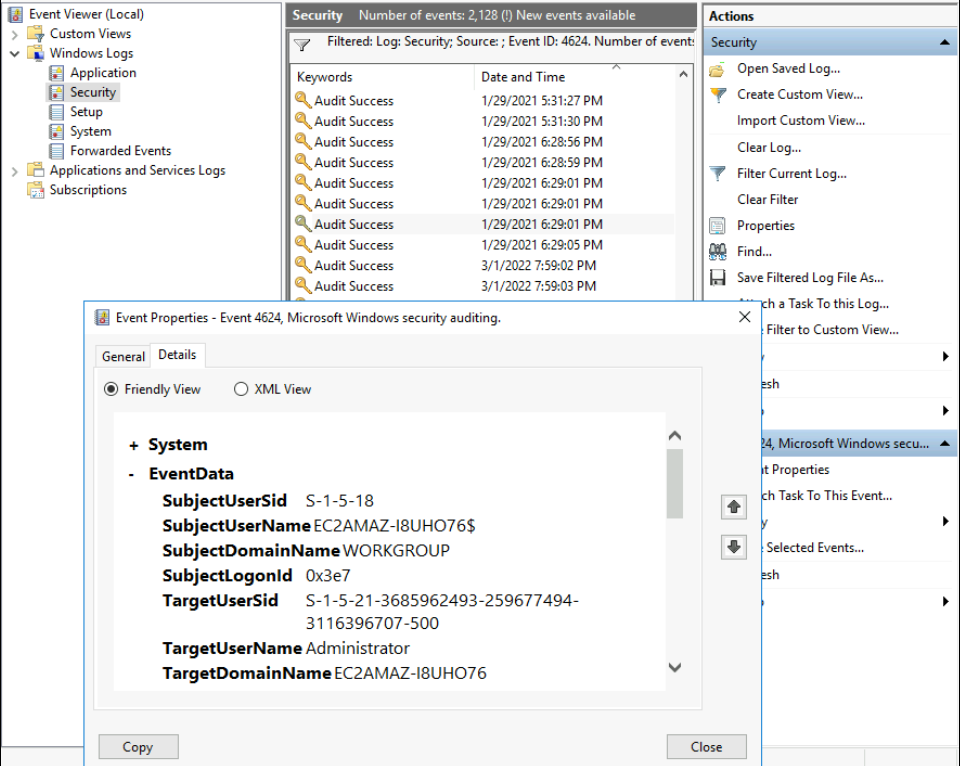
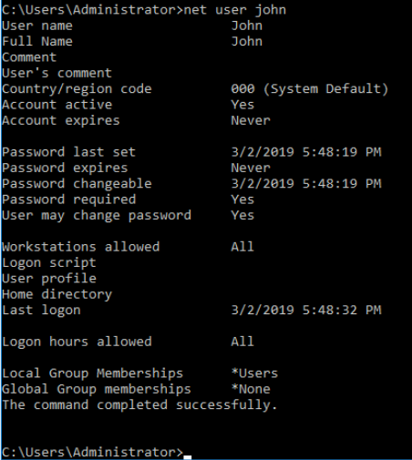
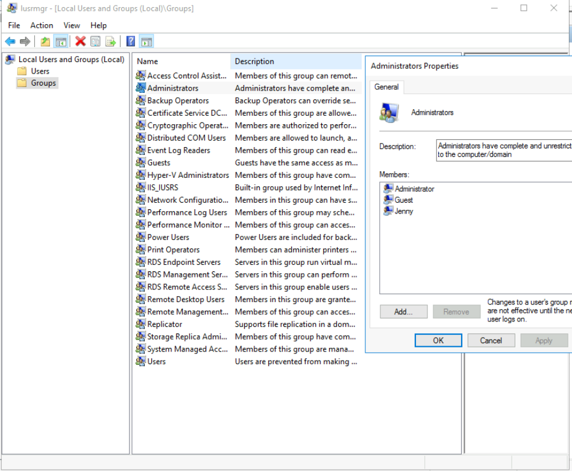
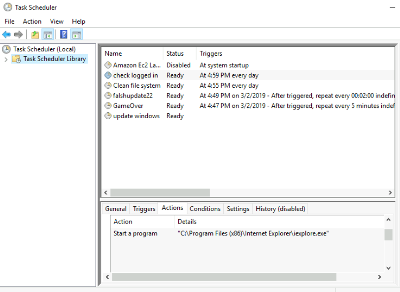
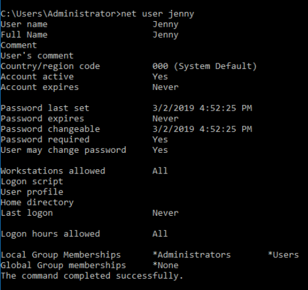
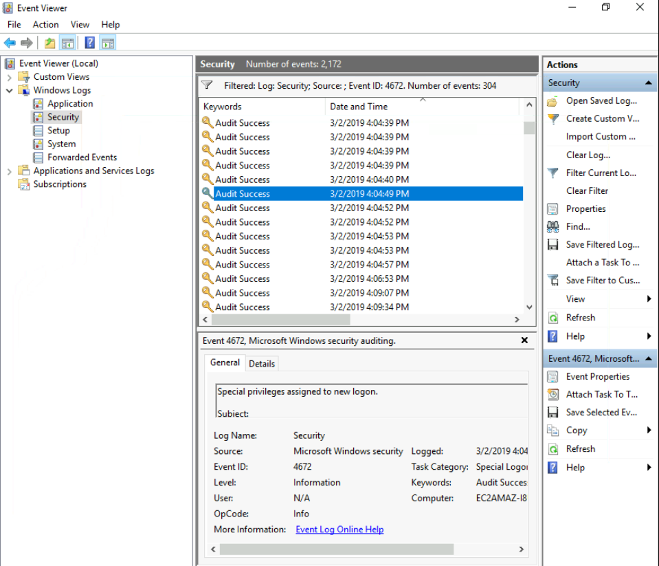
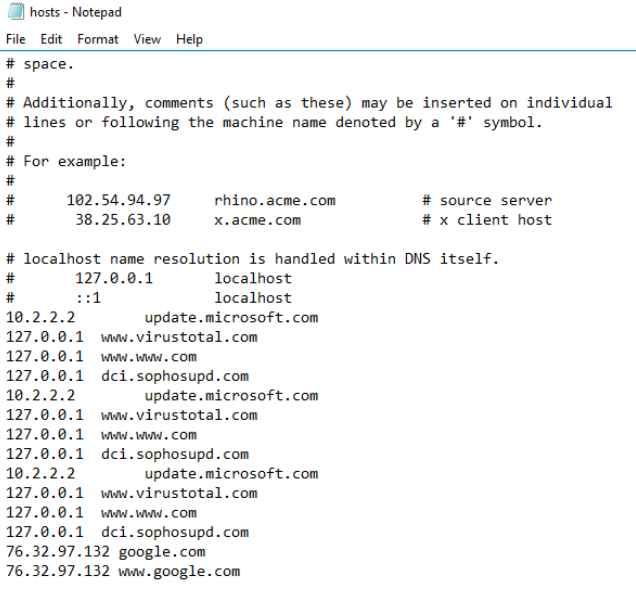
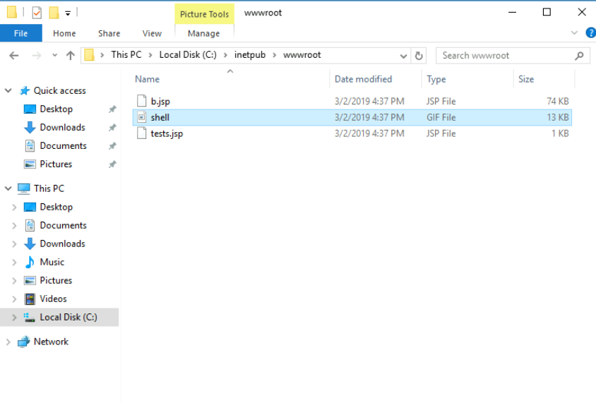

# Tryhackme - [Investigating Windows](https://tryhackme.com/room/investigatingwindows) 
Written on 01/03/2022

## Description

This is a challenge that is exactly what is says on the tin, there are a few challenges around investigating a windows machine that has been previously compromised.

## Questions

- Whats the version and year of the windows machine?

This can be seen in **msinfo**

Answer:

> Windows Server 2016 

- Which user logged in last?
**Event viewer** can be used to determine this by inspecting the Security logs

Logs can be filtered by their event id. A list of these ids can be found [here](https://www.ultimatewindowssecurity.com/securitylog/encyclopedia/)

The id for successful logins is 4624. I sorted the logs by time, and found the previous date(the first was the date I connnected), and checked the most recent log that didn't have "SYSTEM" attributed to the account name. The user that last logged on was Administrator

Answer:

> Administrator

- When did John log onto the system last?

This can be seen in the output of `net user john` into cmd/powershell

Answer:

> 03/02/2019 5:48:32 PM

- What IP does the system connect to when it first starts?
A cmd window opened when I started the machine, it was trying to connect to 10.34.2.3 but I forgot to take a picture and closed it

Answer

> 10.34.2.3

- What two accounts had administrative privileges (other than the Administrator user)?

This can be seen in **lusrmgr.msc**, under Groups/Administrators

Answer:

> jenny, guest

- What is the name of the scheduled task that is malicious?

Scheduled tasks can be inspected in **Task Scheduler**

There are 6 tasks configured on the machine

- Amazon Ec2 Launch -> Starts an initialization script, this is innocent
- check logged in -> Simply starts internet explorer
- Clean file system -> Starts "C:\\TMP\\nc.ps1 -l 1348". This looks like powershell netcat
- falshupdate22 -> Starts a powershell instance every 2 minutes that does nothing
- GameOver -> Uses mimikatz every 5 minutes to get user passwords and outputs them to C:\\TMP\\o.txt
- update windows -> Starts the internet explorer installer, this one is not even scheduled

Answer:

> Clean file system 

- What file was the task trying to run daily?

We saw that in task scheduler

Answer:

> nc.ps1

- What port did this file listen locally for?

We also saw that in task scheduler

Answer:

> 1348

- When did Jenny last logon?

`net user jenny` into cmd output:

Answer:

> Never

- At what date did the compromise take place?

Judgin by the way the tasks are scheduled, it's safe to say compromise date is 03/02/2019

Answer:

> 03/02/2019

- At what time did Windows first assign special privileges to a new logon?

The event id for this in **Event Viewer** is 4672

For some reason, the room asks specifically for this time, even though there are others before it

Answer:

> 03/02/2019 04:04:49 PM

- What tool was used to get Windows passwords?

In Task Scheduler we saw a task that starts mim.exe every 5 minutes, which is an executable for mimikatz

> mimikatz

- What was the attackers external control and command servers IP?

I checked the **hosts** file, and google.com's ip was replaced with this one, which is the C2 server's

Answer:

> 76.32.97.132

This also answers this other question:

- Check for DNS poisoning, what site was targeted?

Answer:

> google.com

- What was the extension name of the shell uploaded via the servers website?

The default windows web server holds files in C:\\inetpub\\wwwroot

Checking the folder there are 3 files:

The "shell" file had a .gif extension, so I figured the shell was one of the other two files which were **.jsp**

Answer:

> .jsp

- What was the last port the attacker opened?

I checked the firewall inbound rules, and the first one at top was named "Allow outside connections for development". This allowed any IP to connect to port 1337 with any program. So I figured this was the answer

Answer:

> 1337

## Conclusion

This room helped me get more familiar with forensics on a Windows machine

