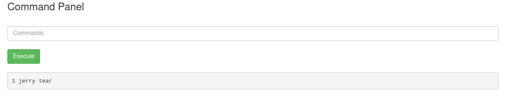

# Tryhackme - [Pickle Rick](https://tryhackme.com/room/picklerick) 
Written on 16/12/2021

## Description
This Rick and Morty themed challenge requires you to exploit a webserver to find 3 ingredients that will help Rick make his potion to transform himself back into a human from a pickle.


## Challenges

1. What is the first ingredient Rick needs?
2. What is the second ingredient Rick needs?
3. What is the third ingredient Rick needs?


# Writeup


## Enumeration

After starting the machine, the first thing I did was check the website, knowing that it was running a web server. 

Only main page seemed accessible, it contained this message:


I checked the page's source code to find Rick's commented username.


## Scanning and web directory enumeration

At this point I started an <b>nmap</b> scan with the <b>-sV</b> flag set on the top 1000 ports to find what services are running on the open ports of the machine.

```
sudo nmap -vv -sT -sV -O --top-ports 1024 -oN nmap.txt 10.10.167.222 -oN nmap.txt
```

At the same time I started enumerating the websites directories with <b>gobuster dir</b> mode.

```
gobuster dir -t 250 -w /usr/share/wordlists/dirbuster/directory-list-2.3-medium.txt --url 10.10.167.222 > gobuster.txt
```

The nmap scan showed only two open ports, 80 for http for the webserver and 22 for ssh


Gobuster found two directories: assets(which I also saw in the html page source) and server-status


SSH must be what should be used to "logon to" Rick's computer, but first I checked the two directories on the website.

<b>/server-status</b> returns 403 forbidden so I can't access it for now

<b>/assets</b> however is indexed as a web directory, and hosts multiple files


I decided to ignore the jquery and bootstap files as I assumed they only made the website work and had nothing to do with any vulnerabilities on the machine.

My first thought was that the .jpg's and .gif's might contain some hidden information so I downloaded them and used <b>strings</b> to check

However to me it seemed like there was just junk to see, so I moved on to try and ssh into the machine without a password using the R1ckRul3s username.


### SSH Attempt

When trying to login as R1ckRul3s via SSH, I get a permission denied(public key) error, which I understood to mean that to login I need Rick's private key. And as I haven't found anything close to a private key so far, I decided to try something else.

I thought the .gif's and .jpg's I found earlier might be used on other pages, so I ran gobuster again, this time with a different wordlist:

```
gobuster dir -t 250 -w /usr/share/wordlists/dirb/common.txt --url 10.10.167.222 > gobuster2.txt
```


This proved way more succesful, as I noticed that I can access robots.txt and index.html (status code 200).

<b>/index.html</b> was just the default main page

<b>/robots.txt</b> however, which is usually used to specify what search engines should show, contained a single line: `Wubbalubbadubdub`

I assumed this was Rick's password, however I knew SSH wasn't going to work, and at this point found no login page.


## Nikto

I used Nikto to further scan the machine for web server vulnerabilities:

```
nikto -url 10.10.167.222 -output nikto.txt
```

The scan turned out like this:


Thankfully, Nikto found the login.php page, which looked like this:


## Remote commands through the web portal

I used the "R1ckRul3s" username and tried "Wubbalubbadubdub" as the password and managed to log into the website.


The nav menu at the top doesn't do much for me, every button except Commands(portal.php) redirects to /denied.php:


It seems I can run commands, so I ran some:

Unsurprinsingly they're being run by the low-priviledge www-data user

Result of `whoami`:


Result of `pwd`:


Result of `ls -l`:


There are two distinctively interesting files here

Result of `cat Sup3rS3cretPickl3Ingred.txt`:


So that didn't work. I can't use `cat`, so I tried to access the file directly in my browser:

`MACHINE-IP/Sup3rS3cretPickl3Ingred.txt`:


And that was the answer to <b>Challenge #1</b>!

Next, I checked `MACHINE-IP/clue.txt`:


I went back to portal.php

First I listed ( `ls -l` ) the contents of /home and found two users: rick and ubuntu

Result of `cd /home/rick && ls -l`:


So I found the second ingredient, but I know I can't use cat, so I tried to copy it into www-data's home directory:

```
cp "/home/rick/second ingredient" /var/www/html/ingred2.txt
```

But that doesn't seem to work as there is no new file

So I decided to try printing the contents to stdout without using cat, there are multiple ways of doing this, for example `xxd` and `strings` worked, but the simplest and most reliable options would probably be something like `less`:

Result of `less "/home/rick/second ingredients"`:



There's the second ingredient for <b>Challenge #2</b>!


## Privilege escalation

After trying some different commands to get into the /root folder, like trying to see if Rick's private key was readable(but it didn't even exist in the usual home/rick/.ssh), I used `sudo -l` to show what commands www-data might be able to run as the super user. Was not really expecting to find anything but the result surprised me:


Apparently www-data can run all commands as sudo without a password, so I did just that

Result of `sudo ls -al /root`:


I assumed 3rd.txt was what I'm looking for

Result of `sudo less /root/3rd.txt`:


And that's the answer to <b>Challenge #3</b>!


# Conclusion

Pretty nice themed beginner-level CTF, one of the first I ever solved on my own, learned that privilege escalation can be very simple sometimes in highly misconfigured systems.

