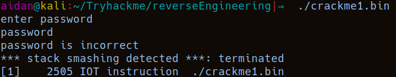

# Tryhackme - [THM Reverse Enginerring Room](https://tryhackme.com/room/reverseengineering) 
Written on 27/02/2022


## Description
In this task, we'll be learning the basics of reverse engineering and assembly. These tasks will make use of crackme files. 

The objective of these files is to understand the assembly code to uncover the right password for the file.


## Crackme1
I first checked the behavior of the file




It seems that typing a password that is longer than the correct one outputs *"stack smashing detected"*. I used this to determine that the correct password should be at most 6 characters long

I then used `strings` on the file:


The screencap above contains all the "interesting" strings I found:

- "strcmp" -> It probably uses strcmp to check if the password is correct
- "hax0r" -> Might be the password
- Nothing else looked like function names, other than "main", so it's probably the only function


I tried **hax0r** as a password and it worked


Answer:
> hax0r

So that was easy. I decided to check the disassembly anyway. For that I'm going to be using **radare2**. 
`r2 -d -A crackme1.bin`

**-d** flag is for debug mode. **-A** for analyzing the binary when starting radare2

The `afl` command can be used to show all function names


We can see that the program uses **puts**, **strcmp**, **scanf**. And confirm that indeed only the **main** function exists

Use `s main` to seek to the main functions memory address

Use `pdf @main` to print the disassembly of main

Here's the main function:


We can see that it stores the *hax0r* string's address in **var_14h**, and our input in **var_eh**. Then it calls strcmp to compare the two and stores the result in **var_18h**. 

`strcmp()` output is 0 if the two compared strings are identical, so it compares **var_18h** to 0, and if the **jne**
jump does not execute, we get the *password is correct* output

So, basically, you could have deduced the password from just looking at the disassembly

## Crackme2

This is what running the file looks like


I jumped straight into radare2 this time

`izz` can be used in the radare2 console to print all strings

```
[0x7f5e50ca2050]> izz
[Strings]
nth paddr      vaddr          len size section            type    string
――――――――――――――――――――――――――――――――――――――――――――――――――――――――――――――――――――――
0   0x00000034 0x55d2a0a00034 4   10                      utf16le @8\t@
1   0x00000238 0x55d2a0a00238 27  28   .interp            ascii   /lib64/ld-linux-x86-64.so.2
2   0x00000293 0x55d2a0a00293 4   5    .note.gnu.build-id ascii   mp?\
3   0x00000391 0x55d2a0a00391 9   10   .dynstr            ascii   libc.so.6
4   0x0000039b 0x55d2a0a0039b 14  15   .dynstr            ascii   __isoc99_scanf
5   0x000003aa 0x55d2a0a003aa 4   5    .dynstr            ascii   puts
6   0x000003af 0x55d2a0a003af 16  17   .dynstr            ascii   __stack_chk_fail
7   0x000003c0 0x55d2a0a003c0 14  15   .dynstr            ascii   __cxa_finalize
8   0x000003cf 0x55d2a0a003cf 17  18   .dynstr            ascii   __libc_start_main
9   0x000003e1 0x55d2a0a003e1 9   10   .dynstr            ascii   GLIBC_2.7
10  0x000003eb 0x55d2a0a003eb 9   10   .dynstr            ascii   GLIBC_2.4
11  0x000003f5 0x55d2a0a003f5 11  12   .dynstr            ascii   GLIBC_2.2.5
12  0x00000401 0x55d2a0a00401 27  28   .dynstr            ascii   _ITM_deregisterTMCloneTable
13  0x0000041d 0x55d2a0a0041d 14  15   .dynstr            ascii   __gmon_start__
14  0x0000042c 0x55d2a0a0042c 25  26   .dynstr            ascii   _ITM_registerTMCloneTable
15  0x000006d1 0x55d2a0a006d1 4   5    .text              ascii   =9\t 
16  0x000007a0 0x55d2a0a007a0 5   6    .text              ascii   AWAVI
17  0x000007a7 0x55d2a0a007a7 5   6    .text              ascii   AUATL
18  0x000007f9 0x55d2a0a007f9 14  16   .text              utf8    \b[]A\A]A^A_f. blocks=Basic Latin,Latin-1 Supplement
19  0x00000824 0x55d2a0a00824 19  20   .rodata            ascii   enter your password
20  0x0000083b 0x55d2a0a0083b 17  18   .rodata            ascii   password is valid
21  0x0000084d 0x55d2a0a0084d 21  22   .rodata            ascii   password is incorrect
22  0x000008b0 0x55d2a0a008b0 4   5    .eh_frame          ascii   \e\f\a\b
23  0x000008e0 0x55d2a0a008e0 4   5    .eh_frame          ascii   \e\f\a\b
24  0x00000907 0x55d2a0a00907 5   6    .eh_frame          ascii   ;*3$"
25  0x00000942 0x55d2a0a00942 4   5    .eh_frame          ascii   u\f\a\b
26  0x00001010 0x55d2a0a00000 41  42   .comment           ascii   GCC: (Ubuntu 7.3.0-27ubuntu1~18.04) 7.3.0
27  0x00001659 0x55d2a0a00001 10  11   .strtab            ascii   crtstuff.c
28  0x00001664 0x55d2a0a0000c 20  21   .strtab            ascii   deregister_tm_clones
29  0x00001679 0x55d2a0a00021 21  22   .strtab            ascii   __do_global_dtors_aux
30  0x0000168f 0x55d2a0a00037 14  15   .strtab            ascii   completed.7696
31  0x0000169e 0x55d2a0a00046 38  39   .strtab            ascii   __do_global_dtors_aux_fini_array_entry
32  0x000016c5 0x55d2a0a0006d 11  12   .strtab            ascii   frame_dummy
33  0x000016d1 0x55d2a0a00079 30  31   .strtab            ascii   __frame_dummy_init_array_entry
34  0x000016f0 0x55d2a0a00098 10  11   .strtab            ascii   crackme2.c
35  0x000016fb 0x55d2a0a000a3 13  14   .strtab            ascii   __FRAME_END__
36  0x00001709 0x55d2a0a000b1 16  17   .strtab            ascii   __init_array_end
37  0x0000171a 0x55d2a0a000c2 8   9    .strtab            ascii   _DYNAMIC
38  0x00001723 0x55d2a0a000cb 18  19   .strtab            ascii   __init_array_start
39  0x00001736 0x55d2a0a000de 18  19   .strtab            ascii   __GNU_EH_FRAME_HDR
40  0x00001749 0x55d2a0a000f1 21  22   .strtab            ascii   _GLOBAL_OFFSET_TABLE_
41  0x0000175f 0x55d2a0a00107 15  16   .strtab            ascii   __libc_csu_fini
42  0x0000176f 0x55d2a0a00117 27  28   .strtab            ascii   _ITM_deregisterTMCloneTable
43  0x0000178b 0x55d2a0a00133 17  18   .strtab            ascii   puts@@GLIBC_2.2.5
44  0x0000179d 0x55d2a0a00145 6   7    .strtab            ascii   _edata
45  0x000017a4 0x55d2a0a0014c 27  28   .strtab            ascii   __stack_chk_fail@@GLIBC_2.4
46  0x000017c0 0x55d2a0a00168 30  31   .strtab            ascii   __libc_start_main@@GLIBC_2.2.5
47  0x000017df 0x55d2a0a00187 12  13   .strtab            ascii   __data_start
48  0x000017ec 0x55d2a0a00194 14  15   .strtab            ascii   __gmon_start__
49  0x000017fb 0x55d2a0a001a3 12  13   .strtab            ascii   __dso_handle
50  0x00001808 0x55d2a0a001b0 14  15   .strtab            ascii   _IO_stdin_used
51  0x00001817 0x55d2a0a001bf 15  16   .strtab            ascii   __libc_csu_init
52  0x00001827 0x55d2a0a001cf 11  12   .strtab            ascii   __bss_start
53  0x00001833 0x55d2a0a001db 4   5    .strtab            ascii   main
54  0x00001838 0x55d2a0a001e0 25  26   .strtab            ascii   __isoc99_scanf@@GLIBC_2.7
55  0x00001852 0x55d2a0a001fa 11  12   .strtab            ascii   __TMC_END__
56  0x0000185e 0x55d2a0a00206 25  26   .strtab            ascii   _ITM_registerTMCloneTable
57  0x00001878 0x55d2a0a00220 27  28   .strtab            ascii   __cxa_finalize@@GLIBC_2.2.5
58  0x00001895 0x55d2a0a00001 7   8    .shstrtab          ascii   .symtab
59  0x0000189d 0x55d2a0a00009 7   8    .shstrtab          ascii   .strtab
60  0x000018a5 0x55d2a0a00011 9   10   .shstrtab          ascii   .shstrtab
61  0x000018af 0x55d2a0a0001b 7   8    .shstrtab          ascii   .interp
62  0x000018b7 0x55d2a0a00023 13  14   .shstrtab          ascii   .note.ABI-tag
63  0x000018c5 0x55d2a0a00031 18  19   .shstrtab          ascii   .note.gnu.build-id
64  0x000018d8 0x55d2a0a00044 9   10   .shstrtab          ascii   .gnu.hash
65  0x000018e2 0x55d2a0a0004e 7   8    .shstrtab          ascii   .dynsym
66  0x000018ea 0x55d2a0a00056 7   8    .shstrtab          ascii   .dynstr
67  0x000018f2 0x55d2a0a0005e 12  13   .shstrtab          ascii   .gnu.version
68  0x000018ff 0x55d2a0a0006b 14  15   .shstrtab          ascii   .gnu.version_r
69  0x0000190e 0x55d2a0a0007a 9   10   .shstrtab          ascii   .rela.dyn
70  0x00001918 0x55d2a0a00084 9   10   .shstrtab          ascii   .rela.plt
71  0x00001922 0x55d2a0a0008e 5   6    .shstrtab          ascii   .init
72  0x00001928 0x55d2a0a00094 8   9    .shstrtab          ascii   .plt.got
73  0x00001931 0x55d2a0a0009d 5   6    .shstrtab          ascii   .text
74  0x00001937 0x55d2a0a000a3 5   6    .shstrtab          ascii   .fini
75  0x0000193d 0x55d2a0a000a9 7   8    .shstrtab          ascii   .rodata
76  0x00001945 0x55d2a0a000b1 13  14   .shstrtab          ascii   .eh_frame_hdr
77  0x00001953 0x55d2a0a000bf 9   10   .shstrtab          ascii   .eh_frame
78  0x0000195d 0x55d2a0a000c9 11  12   .shstrtab          ascii   .init_array
79  0x00001969 0x55d2a0a000d5 11  12   .shstrtab          ascii   .fini_array
80  0x00001975 0x55d2a0a000e1 8   9    .shstrtab          ascii   .dynamic
81  0x0000197e 0x55d2a0a000ea 5   6    .shstrtab          ascii   .data
82  0x00001984 0x55d2a0a000f0 4   5    .shstrtab          ascii   .bss
83  0x00001989 0x55d2a0a000f5 8   9    .shstrtab          ascii   .comment

```

This has a more organized view when compared to `strings` which just prints every string out

We can see that there don't seem to be any functions other than main. We can use `afl` to double check that. Nothing else jumps out at me so I moved on to the disassembly of **main**


We can see that **var_ch** is the pointer to where our input is stored. Note that the input format used in **scanf** is "**%d**", which means that it is reading out input as a number. 

The number is then compared to the hex value **137c** in an if statement further down.  

Converting x137c to decimal can be done in lots of ways, like with **python**:


And that's the password


Answer:
> 4988


## Crackme3
For this one, the Tryhackme room asks for the first 3 letters of the password

Running the program:


Let's move on to radare2. Same as before, `afl` and `izz` show that there's only the main function and there aren't interesting strings

Looking at main, there are two interesting assigments to start off:


The variable **var_23h** is being assigned the **"az"** string, and **var_21h** is being assigned the **'t'** character

Then our input is being read into **var_20h** and **var_28h** is being used as an index counter for a loop:

(Use `s main` and `VV` to get this graph view in radare2)


The for loop compares our input, byte by byte, with the byte at address **rbp** - **x23** +  value at **var_28h**

Because of how the variables are allocated to the stack, at **rbp-x23** we first have the characters **"az"**, with **'a'** at rbp-x23, and **'z'** at rbp-x22, and then the character **'t'** , which is assigned next, is at **rbp-x21**. 

Because the for loop adds **var_28h** (basically an index **i**) to the address at rbp-x23 three times( **i** starts at 0, and the loop runs while **i <= 2**, denoted by the **jle** jump), it firsts checks the characters assigned to the **var_23h** variable, 'a' and 'z', but then it is checking the next character on the stack by adding **2** to the address of **var_23h**, basically checking the memory at an offset of 2, which is exactly where the **'t'** character stored in **var_21h** is. 

To summarize: the for loop checks if the first 3 characters of our input are equal to **"azt"**

Testing this:


Answer:
> azt


## Conclusion
This was some nice practice for reverse engineering some basic programs and understanding how memory is allocated on the stack


